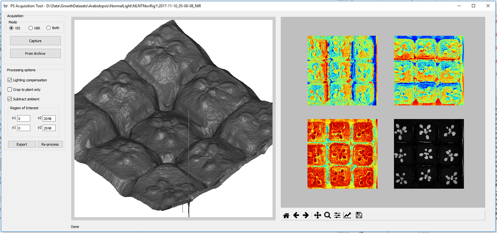
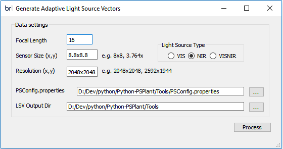
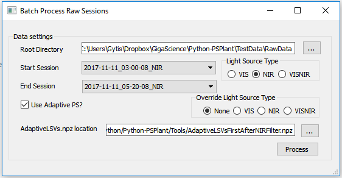
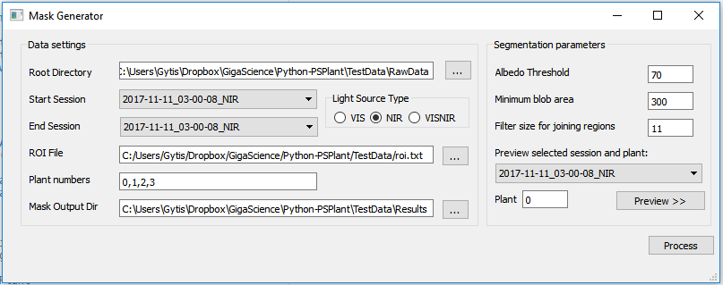
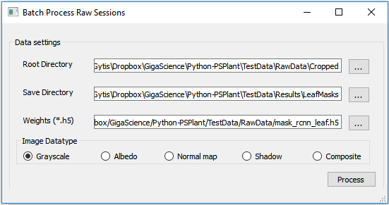
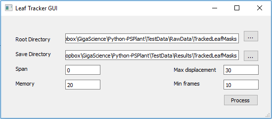
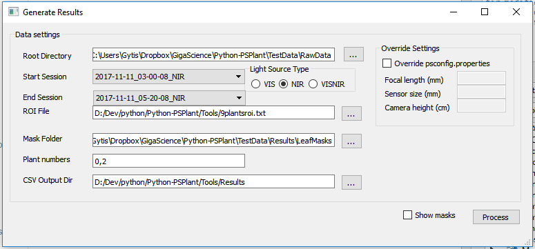

## PS-Plant data processing software 
For "A photometric stereo-based 3D imaging system using computer vision and deep learning for tracking plant growth" paper.


This is an implementation of PS-Plant software in Python 3.5. The software has six components that is the backbone for processing data acquired using PS-Plant plant phenotyping system. Each component runs as a GUI enabling the user to interact with the software. The components are named as follows:

1. Generate Adaptive Light Source Vectors (GenerateAdaptiveLSVGUI)
2. Generate SNZShadowImAndAlbedo_adaptiveLS.npz (BatchProcessRawSessionsGUI)
3. Generate Rosette Masks (MaskGenGUI)
4. Generate Leaf Masks (LeafSegmentationGUI)
5. Generate Tracked Leaf Masks (TrackingGUI)
6. Generate Results (GenerateResultsGUI)

The repository includes:
* Source code for PS-Plant data analysis using python-based GUI applications (Arduino (*.ino) and Python (*.py) scripts, and Qt GUI applications (*.ui))
* Modified Mask R-CNN code for Arabidopsis leaf segmentation (adapted from [Matterport](https://github.com/matterport/Mask_RCNN), original [Mask R-CNN paper by He et al. (2017)](https://arxiv.org/pdf/1703.06870.pdf))
* Requirements.txt file listing the required packages for successfully running the PS-Plant software
* This repository is also supplemented with [test data](https://bit.ly/2IBRzKJ):
	* Pre-trained weights for leaf segmentation using grayscale image modality and Mask R-CNN architecture
	* PS-Plant data acquisitions (10) of Arabidopsis plants
	* Results expected after running the software with the provided data
	* Dataset of manually annotated Arabidopsis leaves (available from [here](https://datashare.is.ed.ac.uk/handle/10283/3200)

## Dependencies
* Python 3.5
* Numpy
* OpenCV
* Matplotlib
* Retrying
* Scikit-image
* Scipy
* Pandas
* trackpy
* Tensorflow 1.9
* Keras 2.2.0
* visvis
* imgaug
* IPython[all]
* PyQT4
* [FlyCapture 2.13.3.31 SDK](https://www.ptgrey.com/support/downloads)
* [PyCapture 2.11.425](https://www.ptgrey.com/support/downloads)

## Installation 
1. Clone this reporitory
2. Install dependencies
	``` bash
	pip3 install -r requirements.txt
	```
3. Download pip unavailable dependencies:
	a) FlyCapture 2.13.3.31 SDK (Grasshopper3 GS3-U3-41C6NIR-C)
	b) PyCapture 2.11.425 (Grasshopper3 GS3-U3-41C6NIR-C)
4. Install pip unavailable dependencies
5. Download test [data](https://bit.ly/2IBRzKJ), which includes:
	a) RawData
		* 10 PS-Plant acquisitions 
		* 10 frames of cropped Plant 0 (grayscale)
		* ROI file for rosette segmentations (roi.txt)
		* 10 frames of rosette masks of Plant 0
		* Pre-trained Mask R-CNN weights for leaf semgentation
		* 10 frames of leaf masks of Plant 0
		* 10 frames of tracked leaf masks of Plant 0
		* ROI file for rosette segmentations (roiLeaf.txt)
	b) Results:
		* Adaptive light source vectors (AdaptiveLSV_r2048x2048_ss8.8x8.8_fl16.npz)
		* 10 frames of rosette masks of Plant 0
		* 10 frames of leaf masks of Plant 0
		* 10 frames of tracked leaf masks of Plant 0
		* Extracted rosette and leaf-level data for Plant 0

6. Install [Arduino 1.8.8 IDE](https://www.arduino.cc/en/Main/Software)
7. Install Arduino MKRZero compatible drivers (Arduino IDE -> Tools -> Board -> Boards Manager -> Arduino SAMD Boards (32-bits ARM Cortex-M0+) tested version 1.6.12)
		
## Getting Started
# psgui3
After a successful installation of dependency software, you may run any of the supplied GUI-based software. The easiest way to investigate the PS data is to run 'psgui3.py' GUI where the GUI displays an integrated 3D surface using Frankot and Chellappa (1988) proposed integration method (left), surface normal directions (right) in x (top-left), y (top-right) and z (bottom-left) directions and albedo image (bottom-right). Click on 'Process from archive' and navigate to the provided raw PS data acquisitions in TestData/RawData directory.

PS data can be also acquired using 'psgui3.py' script:
1. Upload Arduino code to the Arduino in the light controller (Arduino/FlashLEDOnSerial/FlashLEDOnSerial.ino)
2. Note the Arduino comport (Arduino IDE -> Tools -> Port)
3. Update PSConfig.properties file:
	- Light source vectors (if the same design as proposed in the paper, change height information)
	- Arduino comport (found in 2.)
	- Camera lens
4. Select data acquisition mode and processing option parameters.
5. Press 'Capture'



# GenerateAdaptiveLSVGUI 
This script displays a GUI to generate adaptive light source vectors that will be used to generate more accurate 3D representations using PS.
	
In the GUI you have to enter:
	- Focal length of the camera lens;
	- Sensor size of the camera;
	- Resolution of the camera;
	- Path to the PSConfig.properties file;
	- Path where the adaptive light source file will be stored.
	
Generated light source vectors are available in the provided TestData/Results folder. 



# BatchProcessRawSessionsGUI
This is the GUI for processing raw files and generating PS outputs that are stored in SNZShadowImAndAlbedo_adaptiveLS.npz files. 

In the GUI user has to enter:
	- Data directory and light source type (VIS, NIR or VISNIR);
	- Start and end session names;
	- Whether to use or not the adaptive light source vectors (if yes, 
	provide the path to the adaptive light source vectors).
	
The user may run the script on the provided PS-Plant data acquisitions, however, the SNZShadowImAndAlbedo_adaptiveLS.npz files are already provided in the directories in TestData/RawData directory.



# MaskGenGUI
This script displays a GUI to generate rosette masks for the chosen PS-Plant acquisition sessions and desired region of interests (ROI). The GUI allows user to select parameters for better segmentation (threshold, min area, filter size).
	
In the GUI you have to enter:
	- Path to the PS data;
	- Start and end session names from drop down list;
	- ROI file;
	- Plant numbers of interest;
	- Path to the output directory;
	- The user may also preview the output of the chosen parameters (threshold, 
	min area, filter size).
	
Example roi.txt is provided in TestData for the directories in TestData/RawData directories with NIR suffix. The results are provided in TestData/Results/RosetteMasks.


	
# LeafSegmentationGUI
This is the GUI for generating individual leaf segmentations. 

In the GUI, user has to enter:
	- Cropped image data directory (provided model is for images size of 512x512)
	- Save directory
	- Path to the pre-trained Mask R-CNN model weights (TestData/RawData/mask_rcnn_leaf.h5 - trained on grayscale images)
	
The raw data is provided in TestData/RawData/Cropped directory. Example roiLeaf.txt is provided in TestData for the directories in TestData/RawData directories with NIR suffix. The results are provided in TestData/Results/LeafMasks. 



# TrackingGUI
This is the GUI for tracking leaf movements. 

In the GUI you have to enter:
	- Path to the untracked masks;
	- Path to the output directory;
	- Parameters:
		- Span (defaut 0)
		- Memory (default 20)
		- Max displacement (default 30)
		- Min frames (default 10)

Raw data is provided in TestData/RawData/LeafMasks directory or the user generated images from 'LeafSegmentationGUI'. The results are provided in TestData/Results/TrackedLeafMasks.



# GenerateResultsGUI
This is the GUI for extracting rosette and leaf-level growth data from either rosette or leaf masks. 

In the GUI you have to enter:
	- Path to the raw data;
	- Start and end folders;
	- Region of interest (ROI) file;
	- Path to the mask folder;
	- Plant numbers of interest;
	- Path to outputs;
	- Whether to override PSConfig.properties (camera focal length, sensor 
	size and height)
	
Raw data is provided in TestData/RawData/TrackedLeafMasks and TestData/RawData/RosetteMasks directories or the user generated images from 'MaskGenGUI' or 'TrackingGUI'. The results are provided in TestData/Results/DataExtraction for both rosette and leaf segmentations.

